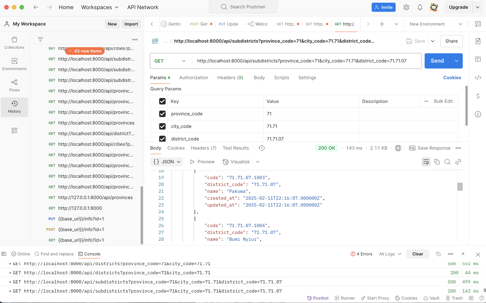

<p align="center"><a href="https://laravel.com" target="_blank"></a></p>

<p align="center">
<a href="https://github.com/laravel/framework/actions"></a>
<a href="https://packagist.org/packages/laravel/framework"></a>
<a href="https://packagist.org/packages/laravel/framework"></a>
<a href="https://packagist.org/packages/laravel/framework"></a>
</p>

## About Laravel

Laravel is a web application framework with expressive, elegant syntax. We believe development must be an enjoyable and creative experience to be truly fulfilling. Laravel takes the pain out of development by easing common tasks used in many web projects, such as:

- [Simple, fast routing engine](https://laravel.com/docs/routing).
- [Powerful dependency injection container](https://laravel.com/docs/container).
- Multiple back-ends for [session](https://laravel.com/docs/session) and [cache](https://laravel.com/docs/cache) storage.
- Expressive, intuitive [database ORM](https://laravel.com/docs/eloquent).
- Database agnostic [schema migrations](https://laravel.com/docs/migrations).
- [Robust background job processing](https://laravel.com/docs/queues).
- [Real-time event broadcasting](https://laravel.com/docs/broadcasting).

Laravel is accessible, powerful, and provides tools required for large, robust applications.

## Learning Laravel

Laravel has the most extensive and thorough [documentation](https://laravel.com/docs) and video tutorial library of all modern web application frameworks, making it a breeze to get started with the framework.

You may also try the [Laravel Bootcamp](https://bootcamp.laravel.com), where you will be guided through building a modern Laravel application from scratch.

If you don't feel like reading, [Laracasts](https://laracasts.com) can help. Laracasts contains thousands of video tutorials on a range of topics including Laravel, modern PHP, unit testing, and JavaScript. Boost your skills by digging into our comprehensive video library.

## Laravel Sponsors

We would like to extend our thanks to the following sponsors for funding Laravel development. If you are interested in becoming a sponsor, please visit the [Laravel Partners program](https://partners.laravel.com).

### Premium Partners

- **[Vehikl](https://vehikl.com/)**
- **[Tighten Co.](https://tighten.co)**
- **[WebReinvent](https://webreinvent.com/)**
- **[Kirschbaum Development Group](https://kirschbaumdevelopment.com)**
- **[64 Robots](https://64robots.com)**
- **[Curotec](https://www.curotec.com/services/technologies/laravel/)**
- **[Cyber-Duck](https://cyber-duck.co.uk)**
- **[DevSquad](https://devsquad.com/hire-laravel-developers)**
- **[Jump24](https://jump24.co.uk)**
- **[Redberry](https://redberry.international/laravel/)**
- **[Active Logic](https://activelogic.com)**
- **[byte5](https://byte5.de)**
- **[OP.GG](https://op.gg)**

## Contributing

Thank you for considering contributing to the Laravel framework! The contribution guide can be found in the [Laravel documentation](https://laravel.com/docs/contributions).

## Code of Conduct

In order to ensure that the Laravel community is welcoming to all, please review and abide by the [Code of Conduct](https://laravel.com/docs/contributions#code-of-conduct).

## Security Vulnerabilities

If you discover a security vulnerability within Laravel, please send an e-mail to Taylor Otwell via [taylor@laravel.com](mailto:taylor@laravel.com). All security vulnerabilities will be promptly addressed.


Berikut adalah **Markdown Text untuk README** yang mencakup seluruh proses pengembangan aplikasi dropdown wilayah (provinsi, kota, kecamatan, dan kelurahan). Saya juga menyediakan tempat untuk menambahkan screenshot Postman.

---

# Wilayah Dropdown Application

Aplikasi ini memungkinkan pengguna untuk memilih wilayah secara bertahap: **Provinsi > Kota > Kecamatan > Kelurahan**. Aplikasi ini menggunakan **Laravel** sebagai backend dan **HTML/JavaScript** dengan **Select2** sebagai frontend.

## Fitur Utama
- Dropdown dinamis untuk memilih provinsi, kota, kecamatan, dan kelurahan.
- Fitur scroll dan search pada dropdown menggunakan **Select2**.
- API RESTful untuk mengambil data dari database.

---

## Daftar Isi
1. [Persyaratan Sistem](#persyaratan-sistem)
2. [Instalasi](#instalasi)
3. [Konfigurasi Database](#konfigurasi-database)
4. [Seeder Data](#seeder-data)
5. [API Endpoints](#api-endpoints)
6. [Frontend](#frontend)
7. [Testing dengan Postman](#testing-dengan-postman)
8. [Screenshots](#screenshots)

---

## Persyaratan Sistem
- PHP >= 8.0
- Laravel >= 9.x
- Node.js (Opsional, jika menggunakan frontend terpisah)
- SQLite atau MySQL untuk database
- Axios dan Select2 untuk frontend

---

## Instalasi
1. Clone repositori ini:
   ```bash
   git clone https://github.com/your-repo/wilayah-dropdown.git
   cd wilayah-dropdown
   ```

2. Install dependensi Laravel:
   ```bash
   composer install
   ```

3. Salin file `.env`:
   ```bash
   cp .env.example .env
   ```

4. Generate key aplikasi:
   ```bash
   php artisan key:generate
   ```

5. Jalankan server Laravel:
   ```bash
   php artisan serve
   ```

---

## Konfigurasi Database
1. Edit file `.env` untuk mengonfigurasi database:
   ```env
   DB_CONNECTION=sqlite
   DB_DATABASE=/absolute/path/to/your/database/database.sqlite
   ```

   Atau jika menggunakan MySQL:
   ```env
   DB_CONNECTION=mysql
   DB_HOST=127.0.0.1
   DB_PORT=3306
   DB_DATABASE=your_database_name
   DB_USERNAME=your_username
   DB_PASSWORD=your_password
   ```

2. Jalankan migrasi:
   ```bash
   php artisan migrate
   ```

---

## Seeder Data
1. Jalankan seeder untuk mengisi tabel dengan data contoh:
   ```bash
   php artisan db:seed
   ```

2. Seeder mencakup data untuk tabel berikut:
   - `provinces_code`
   - `cities_code`
   - `districts_code`
   - `subdistricts_code`

---

## API Endpoints
Berikut adalah daftar endpoint API yang tersedia:

| Endpoint                          | Method | Deskripsi                                   |
|-----------------------------------|--------|---------------------------------------------|
| `/api/provinces`                  | GET    | Mendapatkan semua data provinsi             |
| `/api/cities?province_code={code}`| GET    | Mendapatkan data kota berdasarkan provinsi  |
| `/api/districts?city_code={code}` | GET    | Mendapatkan data kecamatan berdasarkan kota |
| `/api/subdistricts?district_code={code}` | GET | Mendapatkan data kelurahan berdasarkan kecamatan |

Contoh respons JSON:
```json
{
    "data": [
        {
            "code": "71",
            "name": "Sulawesi Utara"
        }
    ]
}
```

---

## Frontend
Frontend dibangun menggunakan **HTML**, **CSS**, dan **JavaScript** dengan bantuan library **Axios** dan **Select2**.

### File Penting
- `resources/views/index.blade.php`: Halaman utama aplikasi.
- `public/js/app.js`: Logika JavaScript untuk mengambil data dari API.
- `public/css/styles.css`: Styling halaman.

### Cara Menggunakan
1. Buka browser dan akses:
   ```
   http://localhost:8000
   ```

2. Pilih provinsi, kota, kecamatan, dan kelurahan secara bertahap.

---

## Testing dengan Postman
Untuk memastikan API berfungsi dengan baik, Anda dapat menggunakan Postman untuk menguji endpoint.

### Langkah-Langkah
1. Buka Postman dan masukkan URL endpoint, misalnya:
   ```
   http://localhost:8000/api/provinces
   ```

2. Pilih method `GET`.

3. Lihat respons JSON yang dikembalikan.

### Contoh Pengujian
#### 1. Endpoint `/api/provinces`
- **URL**: `http://localhost:8000/api/provinces`
- **Method**: `GET`
- **Response**:
  ```json
  {
      "data": [
          {
              "code": "71",
              "name": "Sulawesi Utara"
          },
          {
              "code": "72",
              "name": "Sulawesi Tengah"
          }
      ]
  }
  ```

#### 2. Endpoint `/api/cities?province_code=71`
- **URL**: `http://localhost:8000/api/cities?province_code=71`
- **Method**: `GET`
- **Response**:
  ```json
  {
      "data": [
          {
              "code": "71.71",
              "name": "Kota Manado"
          }
      ]
  }
  ```

---

## Screenshots
Tambahkan screenshot berikut untuk dokumentasi:

###  **Postman Testing**
  
*Screenshot hasil testing endpoint menggunakan Postman.*


## License

The Laravel framework is open-sourced software licensed under the [MIT license](https://opensource.org/licenses/MIT).
